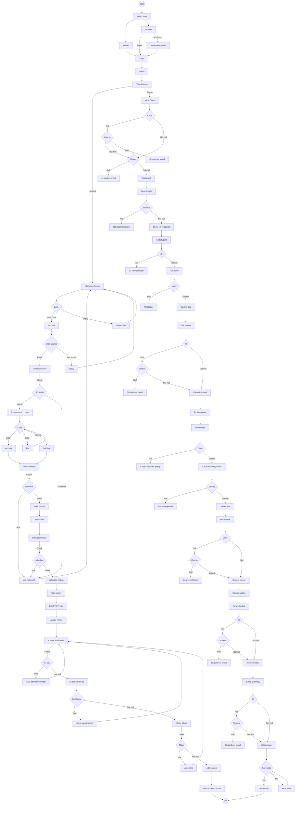

# unknownapp
This is an unknown application written in Java

---- For Submission (you must fill in the information below) ----
### Use Case Diagram

### Flowchart of the main workflow

```mermaid
flowchart TD
    A@{ shape: circle, label: "Start" } --> selectroll[Select Role]
    selectroll -->roleadd[Admin]
    selectroll -->rolestd[Student]
    rolestd --> |found|B
    roleadd --> B[Login]
    B -->  E[Menu]
    rolestd --> |Not found|D[Create new profile]
    D --> B
    E --> F[View Course]
    %% student duty
    F --> |student|G[Register Course]
    G --> H{Code}
    H --> |enter code|I[success]
    H --> |Enpty|J[Unsuccess]
    J --> G
    I -->K{Drop Course}
    K -->|Enroll|L[Current Course]
    K --> |Not enroll|M[empty]
    M -->G
    L -->|check|N{Schedule}
    N --> |enroll|O[Show current course]
    N --> |Not enroll|P[you not enroll]
    P --> G
    O --> Q{Code}
    Q -->|enter|S[success]
    Q -->|enter|T[Fail]
    T -->Q
    S -->V[View schedule]
    Q --> |cancle|R[Nothing]
    R -->V
    V -->|Check|std_schedule{schedule}
    std_schedule --> |Null|P
    std_schedule --> |enroll|Printcourse[Print course]
    Printcourse --> totalcrd[Total Credit]
    totalcrd --> Billsum[Billing summary]
    Billsum --> |Check|schedule{schedule}
    schedule --> |Null|P
    schedule --> |enroll|caltuition[Calculate Tuition]
    caltuition --> total_tui[Total tuition]
    total_tui --> editstdProfile[Edit STD Profile]
    editstdProfile --> Updateprofile[Update Profile]
    Updateprofile --> createstdpro[Create Std Profile]
    createstdpro --> |Check|id{STDID}
    id --> |Null|Stdnoempty[STD cannot be empty]
    Stdnoempty --> createstdpro
    id --> |not null|IDalreadyexits[ID already exists]
    IDalreadyexits --> stdname{Full Name}
    stdname --> |Null|namecannotempty[Name cannot empty]
    stdname --> |Not null|mejor[Show Major]
    mejor --> |Check|majorempty{Major}
    majorempty -->|Null|Undeclare[Undeclare]
    majorempty --> |Not null|addstd[Add student]
    addstd -->showstdprofile[New Student Update]
    Undeclare --> createstdpro
    namecannotempty -->createstdpro
    
    %% admin duty
    F --> |Admin|viewclass[View Class]
    viewclass --> code1{Code}
     
    code1 --> |Null|course{Course}
    code1 --> |Not null|roster{Roster}
    course --> |Not Null|roster
    course -->|Null|notfound[Course not found]
    roster -->|Null|nostdenroll[No student enroll]
    roster -->|Not null|totalenroll[Total enroll]

    totalenroll --> viewstd[View student]
    viewstd -->std1{Student} 
    std1 -->|Null|nostdregister[No student register]
    std1 -->|Not null|showenrollcourse[Show enroll course]

    showenrollcourse -->adminaddstd[Add student]
    adminaddstd -->  addstdid{ID}
    addstdid --> |Null|idcannotempty[ID cannot empty]
    addstdid -->|Not null|fullnamestd[Full name]
    fullnamestd --> major2{Major}
    major2 -->|Null|major2undeclare[Undeclare]
    major2 -->|Not null|adminaddstd1[Student add]

    adminaddstd1 -->editstd[Edit student]
    editstd --> id2{ID}
    id2 -->|Null|std2{student}
    id2 -->|Not null|currentstd[Current student]
    std2 -->|Null|stdnotfound[Student not found]
    std2 -->|Not null|currentstd
    currentstd -->profileupdate[Profile update]


    profileupdate -->addcourse[Add course]
    addcourse -->code3{Code}
    code3 -->|Null|codecannotempty[Code cannot be empty]
    code3 -->|Not null|courseexists[Course already exists]
    courseexists --> prereq{prereq}
    prereq -->|Null|setprereq[Set prerequisites]
    prereq -->|Not null|couseadd1[Course add]


    couseadd1 -->editcourse[Edit course]
    editcourse -->code4{Code}
    code4 -->|Null|course1{Course}
    code4 -->|Not|currentcourse1[Current course]
    course1 -->|Null|coursenotfound[Course not found]
    course1 -->|Not null|currentcourse1
    currentcourse1 -->courseupdate[Course update]


    courseupdate -->viewschedule[View schedule]
    viewschedule -->id3{ID}
    id3 -->|Null|student1{Student}
    student1 -->|Null|stdnotfound1[Student not found]
    id3 -->|Not null|viewschedule1[View schedule]
    student1 -->|Not null|viewschedule1

    viewschedule1 -->billingsum[Billing summary]
    billingsum -->id4{ID}
    id4 -->|Null|std3{Student}
    std3 -->|Null|stdnotfound2[Student not found]
    id4 -->|Not null|billsum1[Bill summary]
    std3 -->|Not null|billsum1

    
    billsum1 -->savedata{Save data}
    savedata -->|Yes|datasave[Data save]
    savedata -->|No|errorsave[Error save]
    errorsave -->savedata
    datasave -->Z@{ shape: circle, label: "End" }

    %% end
    showstdprofile -->Z@{ shape: circle, label: "End" }
```
### Prompts
